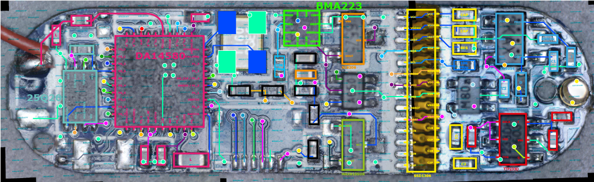

# SmartBracelet
Tearing down a cheap Dialog DA14580 smart bracelet

## Intro
While I was browsing one of those chinese shopping website, lightinthebox, I came across a whole page of fitness trackers. Since I was already ordering some stuff and the cheapest ones were around 7€, I got me too of those.

A long time ago, I started working on a custom wristwatch, but I didn't have the knowledge or tools I have now. These Smart Bracelet got me thinking : there's everything I need in there, the form factor is kinda OK, so this would be a perfect platform to prototype this idea.

Usually, those bracelets contains some kind of lowpower MCU with BLE, an OLED display, a vibration motor, an accelerometer and a battery + battery charging & management circuitry. Some of them have additional sensors for things like heartbeat.

While it was ordered, I started looking on [fccid.io](https://fccid.io/) for similar products. Since the listing contained the reference ID115, I thought I'd get one with a nRF51822. Surprise : the PCB on the model I received was completely different :)

## Hardware

For another project, I hacked together a USB microscope using a Logitech Webcam and some kind of lens assembly from the eyepiece in an old Super8 camera...
This came in handy for this project. I was able to snap a collection of photos and stitch them together to get a hi-res view of the PCB.

Take a look at the huge images for the [front](img/front.jpg) and [back](img/back.jpg), they are 6500x2000px and >7Mb each.

- MCU : Dialog DA14580 [(datasheet)](https://support.dialog-semiconductor.com/downloads/DA14580_DS_v1.63.pdf)
- Flash : W25Q20A 2Mbit Serial Flash Memory
- XTAL : 16MHz
- Accelerometer : BMA223 Digital triaxial acceleration sensor [(datasheet)](https://eu.mouser.com/datasheet/2/783/824138_145236825-1100463.pdf)

### Flash
I couldn't find the exact reference for the Flash chip, but the standard marking implies that :
- 25Q = SPI Flash Serial Flash Memory with 4KB sectors, Dual/Quad I/O
- 20, 20A, 20B, 20C = 2Mbit

### Accelerometer
The BMA223 is a pretty nifty device. It was one of the hardest reference to find, since the "3FL MS" marking were the most cryptic. Fortunately, [Abe Karplus on StackExchange](https://electronics.stackexchange.com/questions/339773/identifying-component-from-i2c-trace-obscure-smd-marking) was right on the money.

### Other chips
- 65Z5 : XC6206 3V 200mA LDO Voltage Regulator
- AKAA : MAX810SUR 3-Pin Microprocessor Reset Circuit
- 2KAX : XT4054 Battery Charger IC
- 233DH : TTP233D-HA6 1-touch IC

There are still 2 chips I couldn't find, marked A650 (SOT-SC70 6 Leads package, I guess) and M80

### Tracing
Using Adobe Illustrator and the photos, I was able to retrace most of the interesting stuff on the PCB

A basic EagleCAD schematic is inside the ecad folder.

### DA14580 pinout

| Pin | Group  | Function |
|-----|--------|----------|
| P0_0 | SPI | SCLK |
| P0_1 | A650 |
| P0_2 | HEADER | ADC |
| P0_3 | SPI | CS# |
| NC   | NC ||
| P0_4 | UART | TX2 |
| P0_5 | UART / SPI | RX2 / SO |
| P2_1 | HEADER | PWR |
| P0_6 | SPI | SI  |
| P0_7 | HEADER | EN |
| XTAL32Km | NC ||
| XTAL32Kp | NC ||
| P2_2 | ? ||
| VBAT_RF | PWR ||
| VBAT3V | PWR ||
| GND | PWR | GND |
| RST | MAX810 | RST |
| P2_3 | ? ||
| VCCDC | PWR ||
| P2_4 | TTP233 | Q |
| SWITCH | PWR | VCCDC through L |
| P1_0 | NC? ||
| VBAT_1V | PWR | NC? |
| P1_1 | M80 | MOTOR |
| SWDIO / P1_5 | SWD / A650 ||
| SWCLK / P1_4 | SWD | SWC |
| P1_2 | NC? ||
| P1_3 | NC? ||
| XTAL16Mp | XTAL ||
| XTAL16Mm | XTAL ||
| VCCDC_RF | RF | VCCDC |
| P2_5 | I2C | SCL |
| P2_6 | I2C | SDA |
| RFIOm | RF | ANTENNA |
| RFIOp | RF | ANTENNA |
| P2_7 | NC? ||
| P2_8 | NC? ||
| VPP | SWD | VPP (High Voltage Programming) |
| P2_9 | 2KAX? ||
| P2_0 | NC? ||

## Software

### I2C inspection
The backside of the PCB has a lot of test points, and especially SDA / SCL. Using a cheap logic analyzer, I was able to capture some traffic (csv found in the protocol folder).

Protocol :
400KHz, 7bit addressing
Addresses :
0x3C > SSD1306 OLED diplays
0x1E > ?
0x18 > BMA223

### Phone App
The device communicates via BLE to a phone app called DayDayBand. I tried to uncompile the APK, but most of it is "encrypted" using a lib called libJiagu or ProGuard.
Anyway, there are references to unknown webservices like Yuntu / Autonavi. Could be interesting to check what is sent home...

### DialogSDK

I was able to hook up the DA14580 to my computer using an FTDI board using the RX/TX test pads. This way, I was able to upload a tiny test program, a kind of blink using the vibration motor.

Writeup of this part of the work coming sooner or later...

## Similar Work
[Raphael Baron with a nRF51822 based bracelet](https://rbaron.net/blog/2018/05/27/Hacking-a-cheap-fitness-tracker-bracelet.html)
[Gordon with a nRF51822 based bracelet](http://forum.espruino.com/conversations/280747/)
